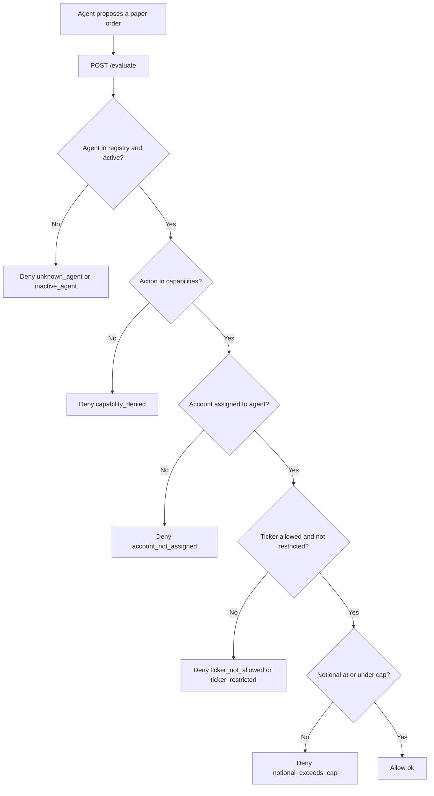

# Know Your Agent — request flow

Fictional Cedar Quill Desk evaluates a proposed paper order only after the agent is identified.

All names, tickers, accounts, and thresholds in this diagram are fictional. This lab does not execute orders and is not investment guidance.
