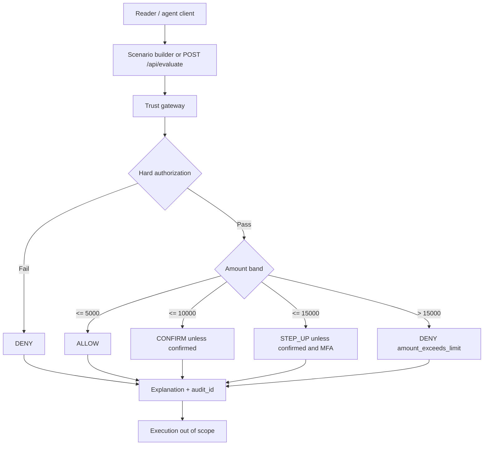

# Know Your Agent — request flow

Fictional Cedar Quill Markets evaluates a proposed paper order in a trust gateway. The lab does not execute orders.

Authentication is identity. Authorization is delegated scope. Policy evaluation applies both plus amount context. Audit is returned in the response and is not product telemetry.
